# Notes

## Comparison with Structured Streaming

**Basic building block.** Structured streaming: batch. Flink: stream.

Structured streaming: Batch is batch. Stream is micro-batch (experimental: continuous processing).

Flink: Batch is bounded stream. Stream is unbounded stream.

**Data consistency guarantee.** End-to-end exactly-once fault-tolerance for both.

**APIs.**

|                               | Structured Streaming                                         | Flink                                                        |
| ----------------------------- | ------------------------------------------------------------ | ------------------------------------------------------------ |
| Primitive operations          | DataFrame, Dataset APIs: MapReduce-like and SQL-like operations see [here](https://spark.apache.org/docs/latest/structured-streaming-programming-guide.html#operations-on-streaming-dataframesdatasets) | DataStream API: MapReduce-like operations, see [here](https://ci.apache.org/projects/flink/flink-docs-release-1.12/dev/stream/operators/)<br />Table API: SQL-like operations, see [here](https://ci.apache.org/projects/flink/flink-docs-release-1.12/dev/table/tableApi.html) |
| Arbitrary stateful operations | `mapGroupsWithState`, `flatMapGroupsWithState`               | `ProcessFunction`                                            |

**Overall.** Spark's APIs seem more unified (Flink's DataSet API is only for batch). But Flink seems to have more natural support for streaming.

## Try Flink

### Local Installation

Environment: Java 8 with flink-1.12.2-bin-scala_2.11.tgz.

Sample repo: https://github.com/largecats/streaming-notes/tree/main/flink/word_count

**Adding dependencies in sbt.** Need to add like this: 

```
libraryDependencies ++= Seq(
  "org.apache.flink" %% "flink-scala" % "1.12.2" % "provided",
  "org.apache.flink" %% "flink-streaming-scala" % "1.12.2" % "provided",
  "org.apache.flink" %% "flink-examples-streaming" % "1.12.2" % "provided",
  ...
  )
```

The `% provided` is required to scope the dependencies. Otherwise might throw this error:

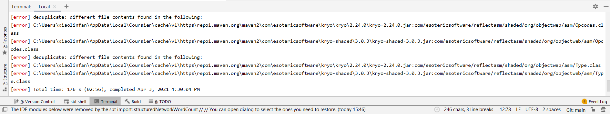

Can search in [Maven repository](https://mvnrepository.com/search?q=flink+scala) for the dependency names.

**Submitting job to cluster.** Submit via 

```
/mnt/c/flink-1.12.2/bin/flink run target/scala-2.11/wordCount.jar
```

#### Questions

**Observation.** Only statements printed via `println("xxx")`:

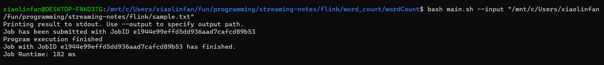

The output of `counts.print()` is not printed to console but stored in `/mnt/c/flink-1.12.2/log/flink-*-taskexecutor-*.out`:

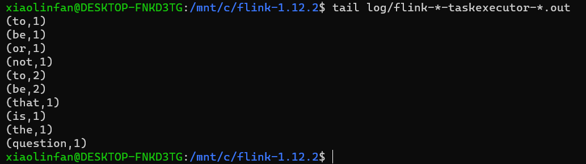

And can be viewed in Flink UI's task manager stdout:

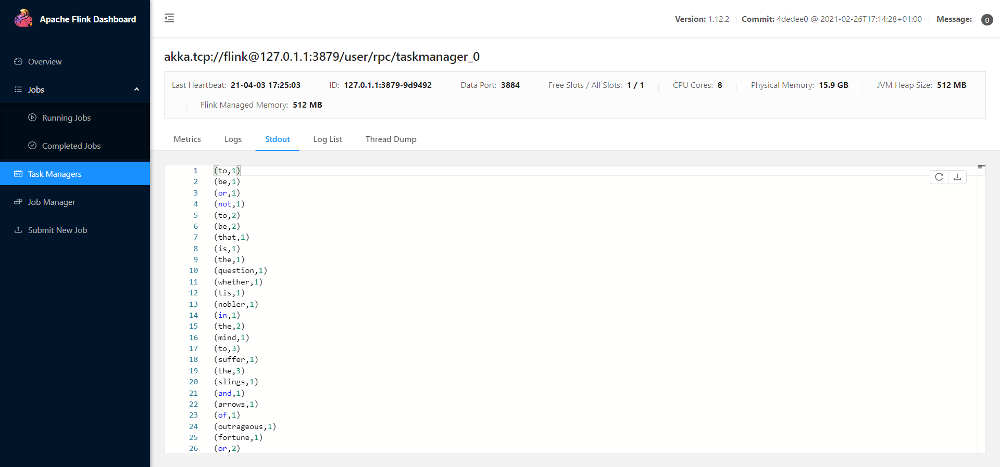

**Investigations.** The difference is because `println("xxx")` prints to console by definition:

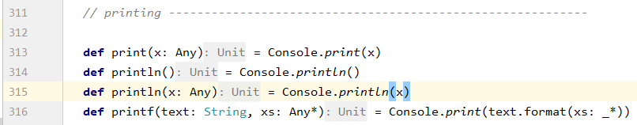

And `counts.print()` prints to stdout by definition: 

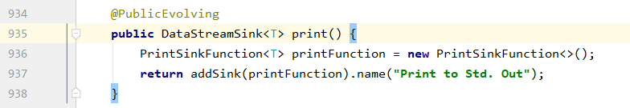

**Questions.**

1. Is there a way to print the result of `counts.print()` to console when running a local Flink cluster? 

   1. https://stackoverflow.com/questions/58209372/flink-dont-print-the-object-in-the-std-output

2. Is there a way to do the same when running a Fink cluster on YARN? E.g., have the flink application run on client (like client mode in Spark)?

   1. From https://ci.apache.org/projects/flink/flink-docs-stable/deployment/#deployment-modes, seems that "application mode" corresponds to cluster mode, and "per-job mode" corresponds to client mode.

   2. To verify, tried starting flink on yarn: https://ci.apache.org/projects/flink/flink-docs-stable/deployment/resource-providers/yarn.html#starting-a-flink-session-on-yarn, but encountered following error. Probably due to version issue.

      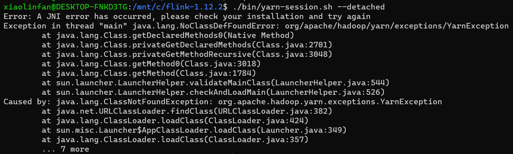

3. Will we be able to use YARN's log aggregation after integrating Flink with YARN?

### Fraud Detection with the DataStream API

In ubuntu, type:

```shell
mvn archetype:generate \
    -DarchetypeGroupId=org.apache.flink \
    -DarchetypeArtifactId=flink-walkthrough-datastream-scala \
    -DarchetypeVersion=1.12.2 \
    -DgroupId=frauddetection \
    -DartifactId=frauddetection \
    -Dversion=0.1 \
    -Dpackage=spendreport \
    -DinteractiveMode=false
```

Then create project from existing sources in IntelliJ, choose maven instead of sbt.

Error:

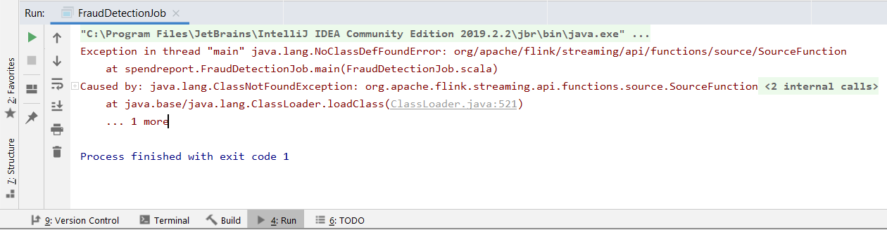

Solution: In `pom.xml`, change `<scope>provided</scope>` to `<scope>compile</scope>`. See https://stackoverflow.com/questions/54106187/apache-flink-java-lang-noclassdeffounderror.

Dummy code execution (raises alert for every transaction):

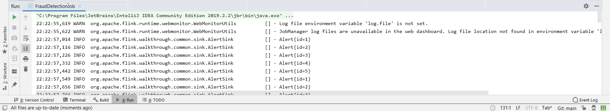

#### Questions

1. Why is `timerState` needed?

### Real Time Reporting with the Table API

##### Install docker in WSL

https://docs.docker.com/engine/install/ubuntu/ (not needed with docker desktop)

Error: 

```shell
$ sudo docker run hello-world
docker: Cannot connect to the Docker daemon at unix:///var/run/docker.sock. Is the docker daemon running?
```

Solution: 

1. Install docker desktop and convert WSL to WSL 2. https://stackoverflow.com/questions/61592709/docker-not-running-on-ubuntu-wsl-cannot-connect-to-the-docker-daemon-at-unix

2. Enable WSL integration in docker desktop:

   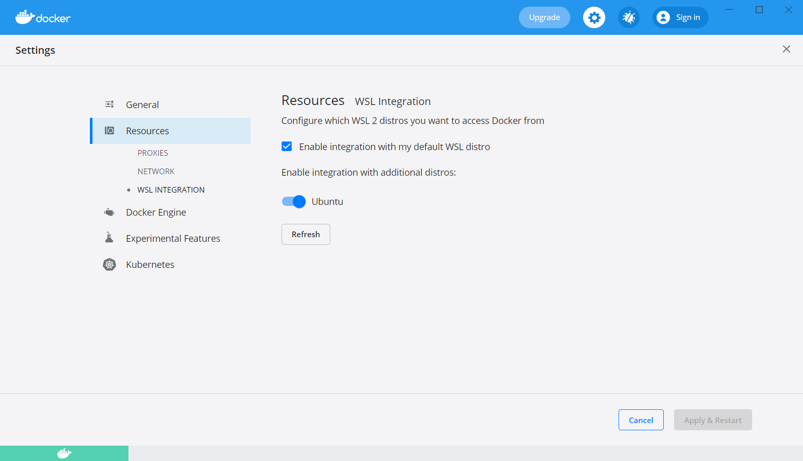

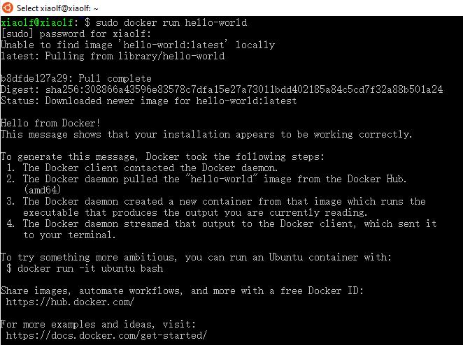

##### Build docker container

Error:

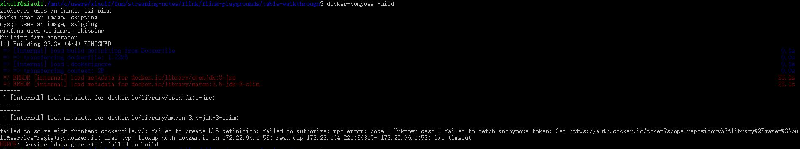

Solution: Docker Desktop >> Docker Engine >> "buildkit": false

https://stackoverflow.com/questions/65361083/docker-build-failed-to-fetch-oauth-token-for-openjdk

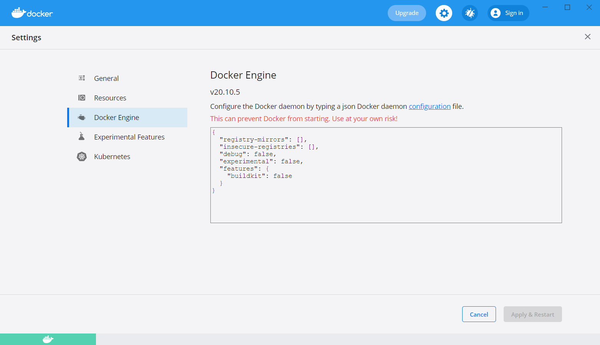

After successful build and run:

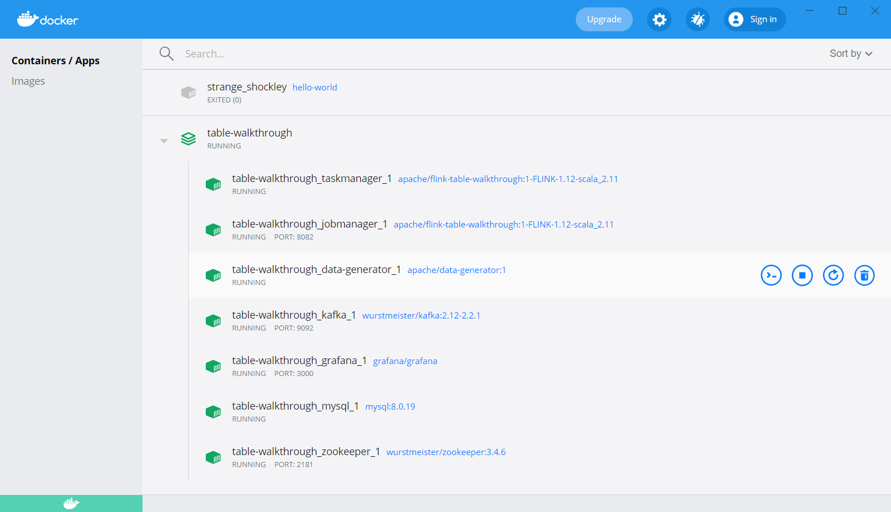

## To-do

1. Replicate Structured Streaming's word count example in Flink (reading from port),
2. Replicate the fraud detection example using sbt instead of maven.
3. Find out how Flink implements watermark and ProcessFunction and how Flink differs from Structured Streaming in these aspects.