# Comparison with Spark

|                                       | Spark                                                        | Flink                                                        |
| ------------------------------------- | ------------------------------------------------------------ | ------------------------------------------------------------ |
| Model                                 | Batch is batch.<br />Stream is micro-batch.                  | Stream is unbounded stream.<br />Batch is bounded stream.    |
| APIs                                  | Batch & Stream: RDD (MapReduce-like), DataFrame, Dataset (SQL-like) | Batch: DataSet (MapReduce-like), Table (SQL-like) <br />Stream: DataStream (MapReduce-like), Table (SQL-like) |
| Arbitrary stateful operations support | `mapGroupsWithState`, `flatMapGroupsWithState`               | `ProcessFunction`                                            |

Concepts:

Read Concepts >> Architecture

| Concept                          | Flink                  | Spark                       |
| -------------------------------- | ---------------------- | --------------------------- |
| Orchestrator of the cluster.     | JobManager             | Application master          |
| Worker processes of the cluster. | TaskManager            | Executor                    |
|                                  | One-to-one streams     | Narrow transformations      |
|                                  | Redistributing streams | Wide transformation/shuffle |
| Basic unit of work.              | Task                   | Stage                       |

# Try Flink

## Local Installation

Environment: Java 8 with flink-1.12.2-bin-scala_2.11.tgz.

Sample repo: https://github.com/largecats/streaming-notes/tree/main/flink/word_count

**Adding dependencies in sbt.** Need to add like this: 

```
libraryDependencies ++= Seq(
  "org.apache.flink" %% "flink-scala" % "1.12.2" % "provided",
  "org.apache.flink" %% "flink-streaming-scala" % "1.12.2" % "provided",
  "org.apache.flink" %% "flink-examples-streaming" % "1.12.2" % "provided",
  ...
  )
```

The `% provided` is required to scope the dependencies. Otherwise might throw this error:

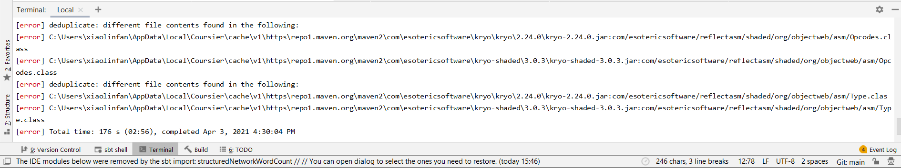

Can search in [Maven repository](https://mvnrepository.com/search?q=flink+scala) for the dependency names.

If directly running the main class in IDE instead of using sbt-assembly, go to "Edit Configurations" and select "Include dependencies with 'Provided' scope".

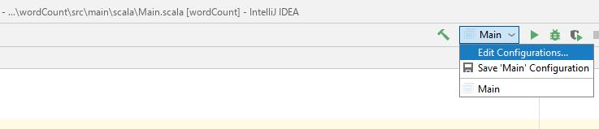

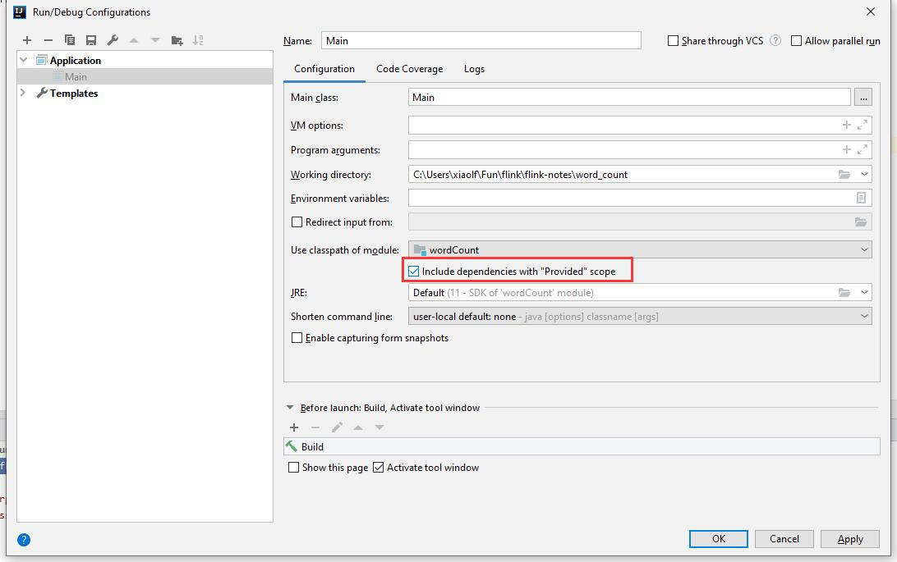

**Submitting job to cluster.** Submit via 

```
/mnt/c/flink-1.12.2/bin/flink run target/scala-2.11/wordCount.jar
```

**Questions**

When running in IDE, all statements are printed to the console:

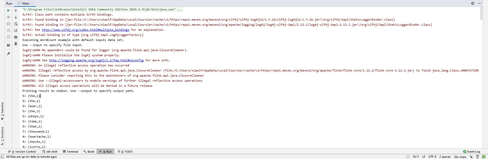

In WSL, only statements printed via `println("xxx")`:

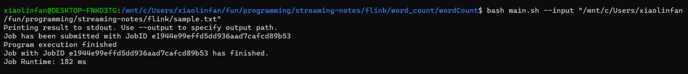

The output of `counts.print()` is not printed to console but stored in `/mnt/c/flink-1.12.2/log/flink-*-taskexecutor-*.out`:

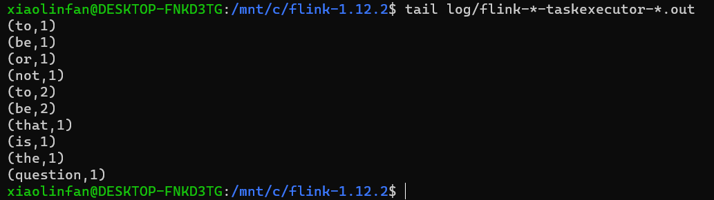

And can be viewed in Flink UI's task manager stdout:

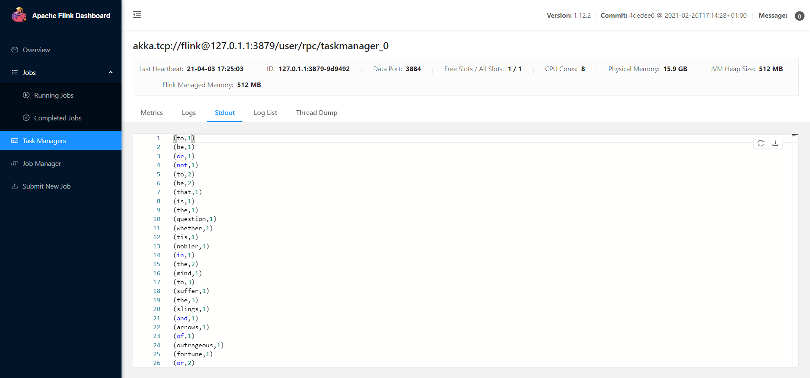

The difference is because `println("xxx")` prints to console by definition:

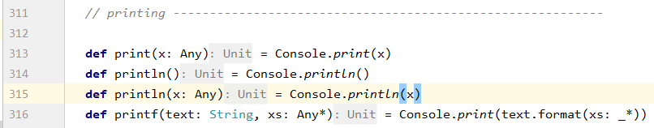

And `counts.print()` prints to stdout by definition: 

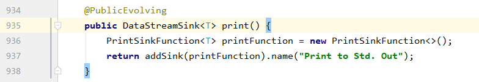

Executor log redirection.

1. Is there a way to print the result of `counts.print()` to console when running a local Flink cluster? 

   1. https://stackoverflow.com/questions/58209372/flink-dont-print-the-object-in-the-std-output

2. Is there a way to do the same when running a Fink cluster on YARN? E.g., have the flink application run on client (like client mode in Spark)?

   1. From https://ci.apache.org/projects/flink/flink-docs-stable/deployment/#deployment-modes, seems that "application mode" corresponds to cluster mode, and "per-job mode" corresponds to client mode.

   2. To verify, tried starting flink on yarn: https://ci.apache.org/projects/flink/flink-docs-stable/deployment/resource-providers/yarn.html#starting-a-flink-session-on-yarn, but encountered following error. Probably due to version issue.

      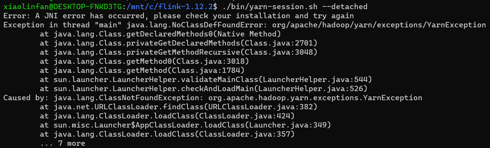
      
      Maybe need to add config files for Flink. Check if `hadoop classpath` has output.

3. Will we be able to use YARN's log aggregation after integrating Flink with YARN?

   Can. But we don't necessarily have the need for log aggregation.

## Fraud Detection with the DataStream API

In ubuntu, type:

```shell
mvn archetype:generate \
    -DarchetypeGroupId=org.apache.flink \
    -DarchetypeArtifactId=flink-walkthrough-datastream-scala \
    -DarchetypeVersion=1.12.2 \
    -DgroupId=frauddetection \
    -DartifactId=frauddetection \
    -Dversion=0.1 \
    -Dpackage=spendreport \
    -DinteractiveMode=false
```

Then create project from existing sources in IntelliJ, choose maven instead of sbt.

**Error: java.lang.NoClassDefFound**

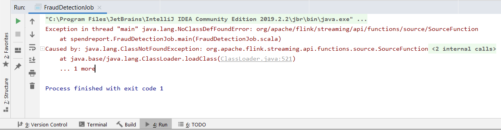

Solution: 

- If using maven, in `pom.xml`, change `<scope>provided</scope>` to `<scope>compile</scope>`. See https://stackoverflow.com/questions/54106187/apache-flink-java-lang-noclassdeffounderror.


Dummy code execution (raises alert for every transaction):

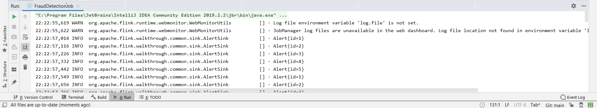

**Questions**

1. Why is `timerState` needed? To cancel the timer? Does that mean timer is uniquely identified by the time left to fire?

## Real Time Reporting with the Table API

### Install docker in WSL

https://docs.docker.com/engine/install/ubuntu/ (not needed with docker desktop)

**Error: Cannot connect to Docker daemon**

```shell
$ sudo docker run hello-world
docker: Cannot connect to the Docker daemon at unix:///var/run/docker.sock. Is the docker daemon running?
```

Solution: 

1. Install docker desktop and convert WSL to WSL 2. https://stackoverflow.com/questions/61592709/docker-not-running-on-ubuntu-wsl-cannot-connect-to-the-docker-daemon-at-unix

2. Enable WSL integration in docker desktop:

   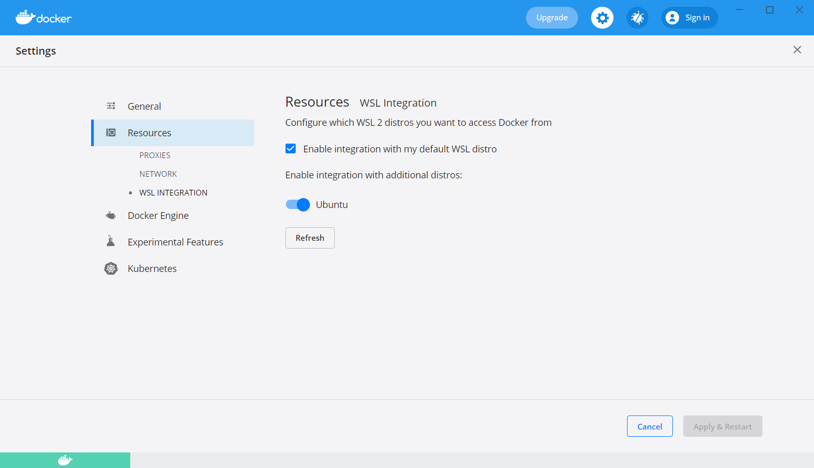

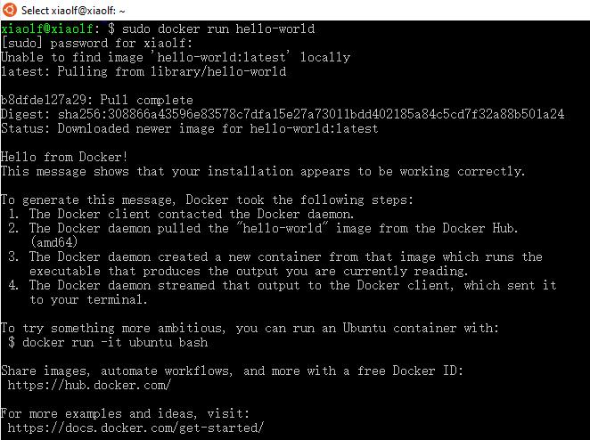

### Build docker container

**Error: Failed to build**

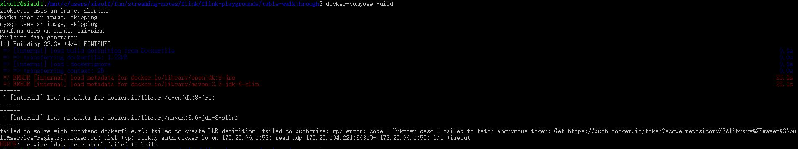

Solution: Docker Desktop >> Docker Engine >> "buildkit": false

https://stackoverflow.com/questions/65361083/docker-build-failed-to-fetch-oauth-token-for-openjdk

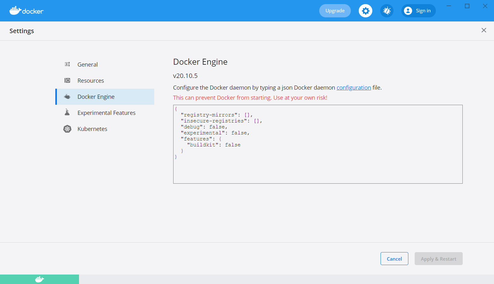

After successful build and run:

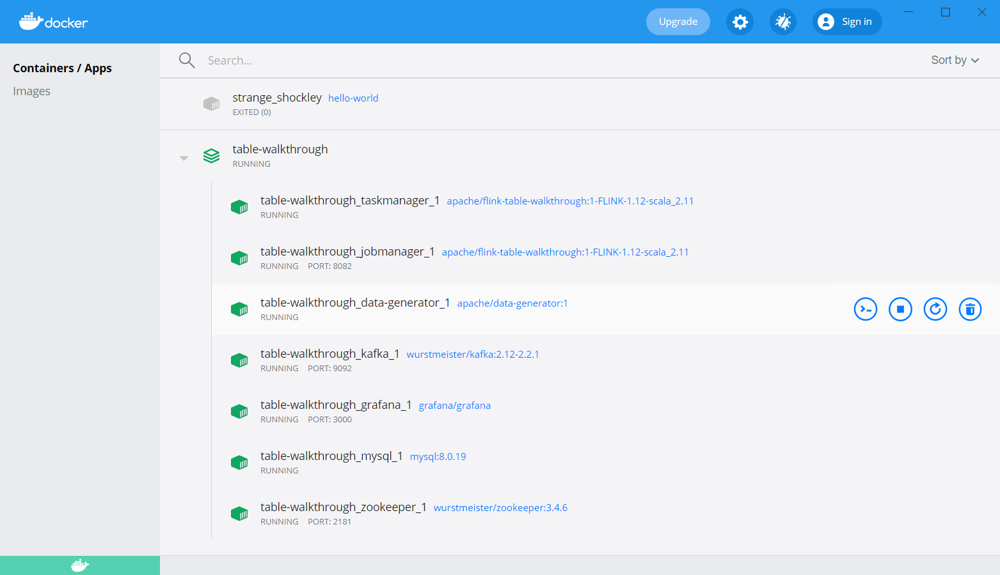

If the Flink console does not display anything and the sql database is empty, the application might have terminated unexpectedly, check logs to verify (see https://ci.apache.org/projects/flink/flink-docs-release-1.12/try-flink/flink-operations-playground.html#logs):

```
docker-compose logs -f jobmanager
```

## Flink Operations Playground

**Error: posixpath - no such file or directory**

```
Traceback (most recent call last):
  File "bin/docker-compose", line 3, in <module>
  File "compose/cli/main.py", line 67, in main
  File "compose/cli/main.py", line 123, in perform_command
  File "compose/cli/command.py", line 69, in project_from_options
  File "compose/cli/command.py", line 125, in get_project
  File "compose/cli/command.py", line 184, in get_project_name
  File "posixpath.py", line 383, in abspath
FileNotFoundError: [Errno 2] No such file or directory
[3512] Failed to execute script docker-compose
```

Solution: Restart Docker Desktop and WSL. https://github.com/docker/compose/issues/7899

## Upgrading & Rescaling a Job 

**Error: Could not stop with a savejoint job**

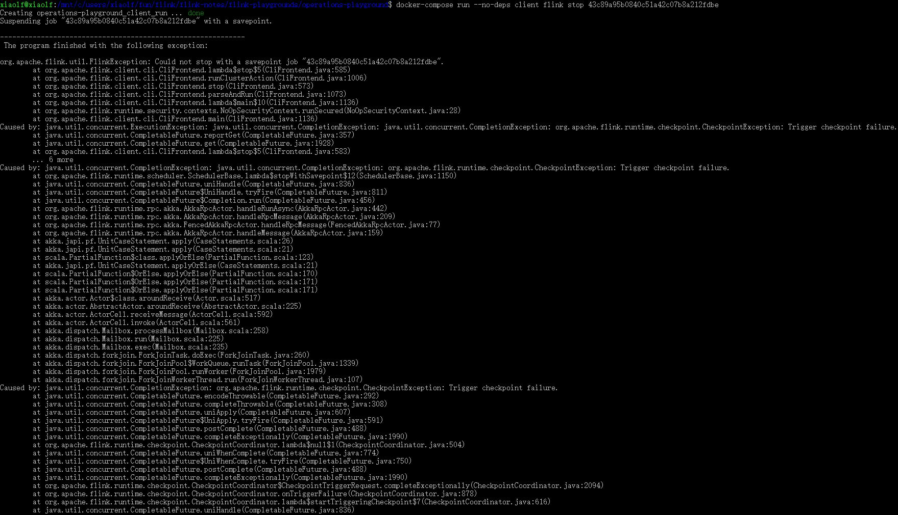

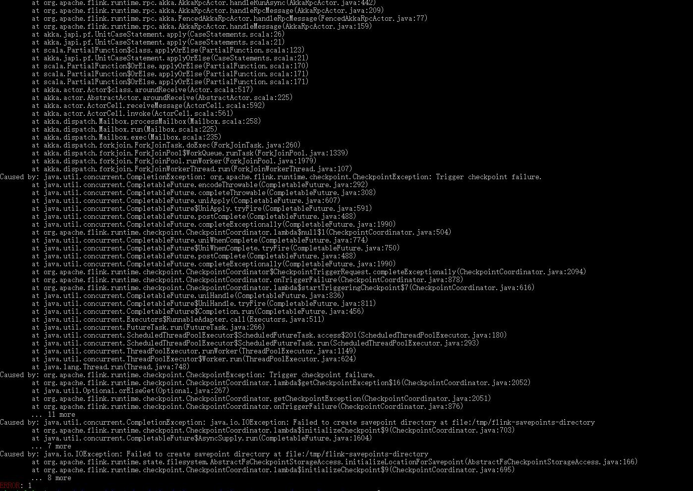

Solution: Error is caused by user not having write permission to /tmp/flink-savepoints-directory. Run `chmod 777 /tmp/flink-savepoints-directory` to change permissions. 

**Questions**

1. What's the right way to do this on c00?

   /tmp/flink-savepoints-directory is just the default directory for Flink to store savepoints. Can configure another directory with the proper permissions (e.g., /home/<username>) for Flink to store savepoints for jobs submitted by each user.

# Learn Flink

## Overview

```java
DataStream<Person> flintstones = env.fromElements(
    new Person("Fred", 35),
    new Person("Wilma", 35),
    new Person("Pebbles", 2));
```

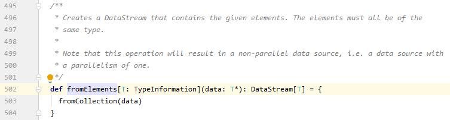

**Questions**

Q: "State is always accessed locally" - does this mean it's stored in the memory/disk of executors (not sure what's the equivalent in Flink)?

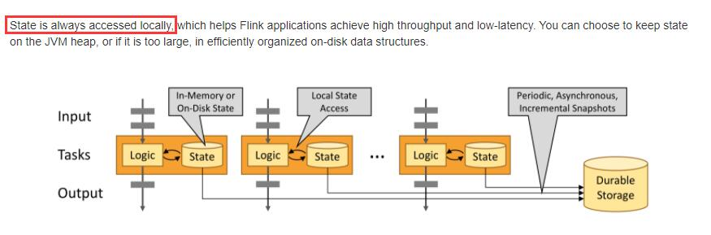

A: It means it's stored in the disk of machines. There seems to be no equivalent of Spark executor process in Flink. Each of the orange box corresponds to a TaskManager.

## Intro to the DataStream API

**Error: Unnecessarily replacing a task that does not exist is not supported**

Solution: Change Gradle to IntelliJ IDEA in IntelliJ IDEA >> File >> Settings >> Build, Execution, Deployment >> Gradle >> Build and run using: IntelliJ IDEA; Run tests using: IntelliJ IDEA.

https://stackoverflow.com/questions/59094029/unnecessarily-replacing-a-task-that-does-not-exist-is-not-supported

**Error: Type TestRideSource not found**

Solution: Add `import org.apache.flink.training.exercises.testing.TaxiRideTestBase.TestRideSource` to /java/org.apache.flink.training.exercises/ridecleansing/RideCleansingTest.java.

## Data Pipelines & ETL

### KeyedStreams

#### Aggregation on Keyed Streams

1. Before adding `import org.joda.time.Interval;`, add `api "joda-time:joda-time:2.10.10"` to \flink-training\common\build.gradle >> dependencies.

2. Need to convert `value.startTime, value.endTime` from `Instant` to `Long` using `toEpochMilli()` before passing to `new Interval()`.

3. Output contains prefix `PT`: https://stackoverflow.com/questions/51168022/what-does-pt-prefix-stand-for-in-duration

   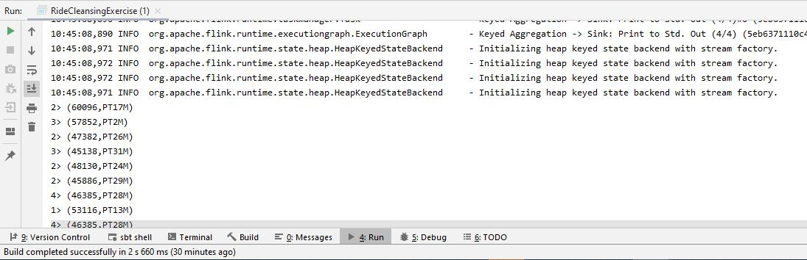

**Questions**

1. What does the flapMap example do? What's the expected output? Doesn't it still collect one record per row?

   It filters that datastream by collecting only those rows that satisfy the condition.

   It collects *at most* one record per row. This example shows that unlike map which performs only one-to-one transformation, flatMap can produce one-to-many or *one-to-none* transformations.

2. Does `keyBy` on its own do anything? Does it repartition the datastream? If so, how to observe the effect (sth like spark's `ds.rdd.glom.collect`)?

   It repartitions the datastream. 

### Stateful Transformations

**Questions**

1. "Vertically scalable" - does it mean scaling the storage of individual machines as opposed to increasing the number of machines in the cluster (horizontally scalable)?

   Yes.

2. Why need to use `Types.BOOLEAN` to tell `ValueStateDescriptor` how to serialize `keyHasBeenSeen`? Doesn't it already know the value state is of type `Boolean`?

   1. The previous two `Boolean` are merely declaration. The `Types.BOOLEAN` is a parameter passed to the constructor `ValueStateDescriptor`. They are not related.

   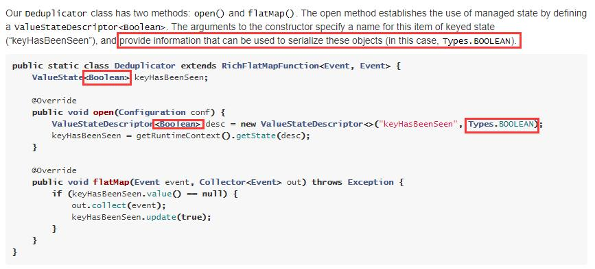

3. Is the same true for Structured Streaming? Seems that the section on stream-stream joins didn't mention anything about partitions of two the two steams.

   1. Spark API is DataFrame/Dataset, doesn't have the low-level details. But if we drill down to the RDD operations, it will be like this:

   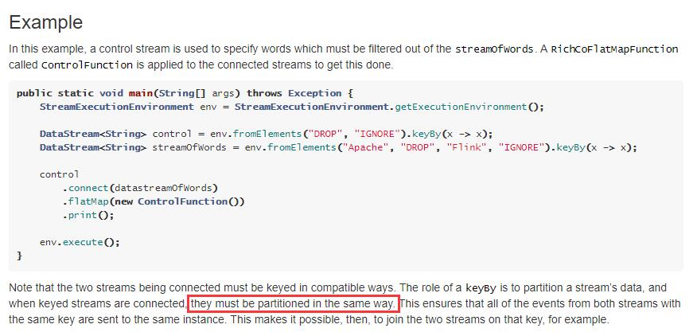

4. States for different keys are kept separately so that each time `EnrichmentFunction` is called, the `flatMap1, flaMap2` are called with respect to the same key?

   Yes. Don't need to compare key / interact with other keys. Spark equivalent: KeyedGroup sth.

   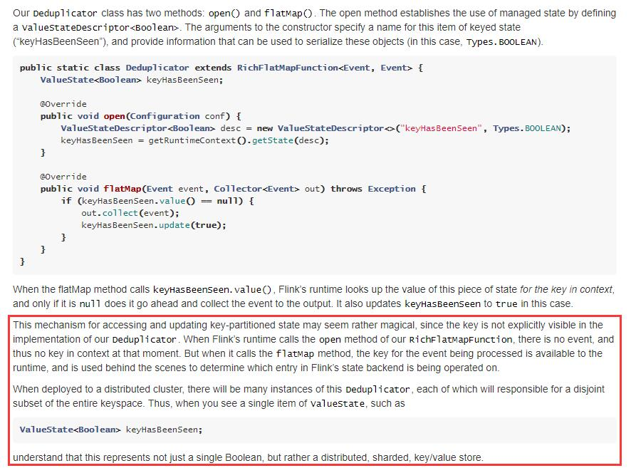

   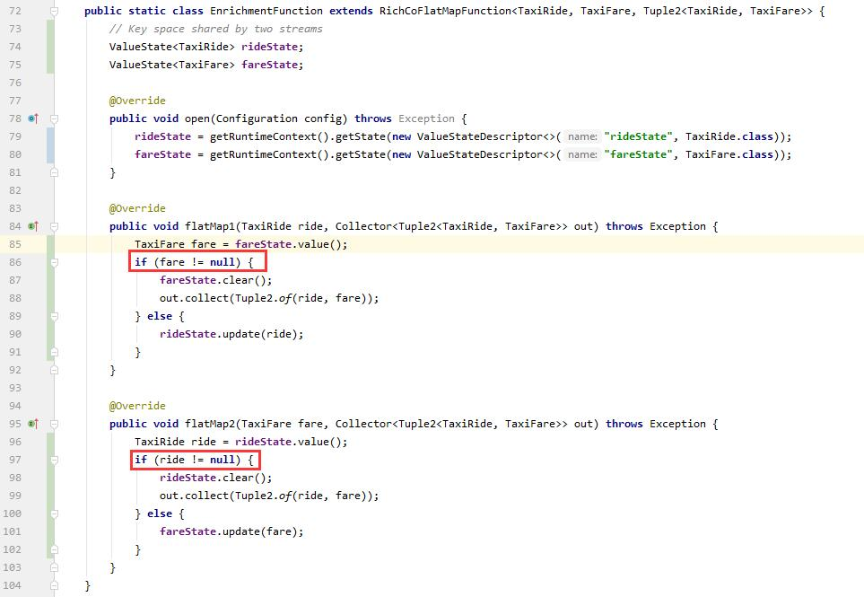

# To-do

1. Replicate Structured Streaming's word count example in Flink (reading from port),
2. Replicate the fraud detection example using sbt instead of maven.
3. Find out how Flink implements watermark and ProcessFunction and how Flink differs from Structured Streaming in these aspects.